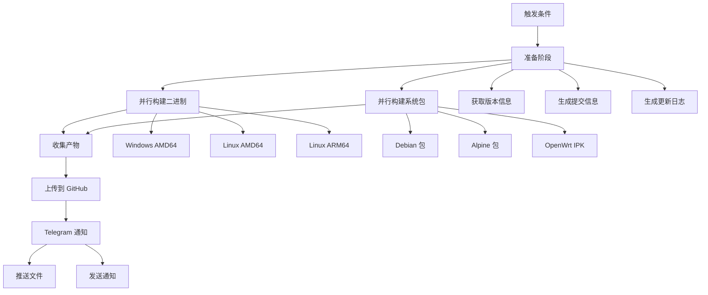

# reF1nd Release 自动化构建工作流

这个 GitHub Actions 工作流专门用于自动构建和发布包含 `reF1nd` 标签的 sing-box 版本。

## 功能特性

### 🚀 自动触发
- **标签触发**: 当推送包含 `reF1nd` 的标签时自动触发
- **手动触发**: 支持通过 GitHub Actions 界面手动触发

### 🔧 并行构建
工作流会并行构建以下版本：

**二进制文件**:
- Windows AMD64 (`.exe`)
- Linux AMD64
- Linux ARM64 (OpenWrt aarch64_cortex-a53)

**系统包**:
- Debian 包 (`.deb`) - Linux AMD64
- Alpine 包 (`.apk`) - Linux AMD64  
- OpenWrt IPK 包 (`.ipk`) - aarch64_cortex-a53

### 📦 产物管理
- 自动收集所有构建产物
- 上传到 GitHub Actions Artifacts
- 保留 30 天

### 📱 Telegram 集成
- 自动推送所有构建文件到 Telegram
- 发送详细的构建报告通知
- 包含版本信息、提交信息和更新日志
- 支持重试机制和错误处理

## 配置要求

### GitHub Secrets

需要在仓库设置中配置以下 Secrets：

```
TELEGRAM_BOT_TOKEN    # Telegram Bot Token
TELEGRAM_CHAT_ID      # Telegram 聊天 ID (可以是群组或频道)
```

### 可选 Secrets (用于包签名)
```
GPG_KEY              # GPG 私钥 (用于签名 deb/rpm 包)
GPG_PASSPHRASE       # GPG 密码
GPG_KEY_ID           # GPG 密钥 ID
```

## 使用方法

### 方法 1: 标签触发 (推荐)

1. 创建包含 `reF1nd` 的标签：
```bash
git tag v1.8.0-reF1nd-beta1
git push origin v1.8.0-reF1nd-beta1
```

2. 工作流会自动触发并开始构建

### 方法 2: 手动触发

1. 进入 GitHub 仓库的 Actions 页面
2. 选择 "reF1nd Release Build" 工作流
3. 点击 "Run workflow"
4. 输入包含 `reF1nd` 的标签名称
5. 点击 "Run workflow" 开始构建

## 工作流程



## 构建产物

### 二进制文件
- `sing-box-{version}-windows-amd64.zip`
- `sing-box-{version}-linux-amd64.tar.gz`
- `sing-box-{version}-linux-arm64.tar.gz`

### 系统包
- `sing-box_{version}_linux_amd64.deb`
- `sing-box_{version}_alpine_x86_64.apk`
- `sing-box_{version}_openwrt_aarch64_cortex-a53.ipk`

## Telegram 通知示例

### 文件推送
每个文件会单独推送，包含以下信息：
- 文件名和平台图标
- 版本号
- 平台类型
- 文件类型说明

### 构建报告
包含完整的构建状态报告：
- 整体构建状态
- 版本信息和构建时间
- 提交信息
- 各组件构建状态
- 构建产物列表
- 更新日志
- GitHub Actions 链接

## 故障排除

### 常见问题

1. **Telegram 推送失败**
   - 检查 `TELEGRAM_BOT_TOKEN` 是否正确
   - 确认 Bot 已添加到目标群组/频道
   - 验证 `TELEGRAM_CHAT_ID` 格式正确

2. **构建失败**
   - 检查标签名称是否包含 `reF1nd`
   - 确认代码可以正常编译
   - 查看 GitHub Actions 日志

3. **包构建失败**
   - 检查 `.fpm_systemd` 和 `.fpm_openwrt` 配置文件
   - 确认 `deb2ipk.sh` 脚本可执行

### 调试模式

可以通过修改工作流文件启用调试：

```yaml
env:
  ACTIONS_STEP_DEBUG: true
  ACTIONS_RUNNER_DEBUG: true
```

## 自定义配置

### 修改构建目标

在 `build_binaries` 和 `build_packages` 的 `matrix` 部分修改构建目标：

```yaml
strategy:
  matrix:
    include:
      - { os: windows, arch: amd64, ext: .exe }
      - { os: linux, arch: amd64, ext: "" }
      # 添加更多目标...
```

### 修改构建标签

在工作流的 `BUILD_TAGS` 环境变量中修改：

```yaml
env:
  BUILD_TAGS: 'with_gvisor,with_quic,with_dhcp,with_wireguard,with_utls,with_acme,with_clash_api,with_tailscale'
```

### 自定义 Telegram 消息

修改 `.github/scripts/telegram-upload.sh` 脚本中的消息模板。

## 安全注意事项

1. **Secrets 管理**: 确保所有敏感信息都存储在 GitHub Secrets 中
2. **权限控制**: 限制工作流的触发权限
3. **文件验证**: 上传前验证构建产物的完整性
4. **网络安全**: 使用 HTTPS 进行所有外部通信

## 维护

定期检查和更新：
- Go 版本
- GitHub Actions 版本
- 依赖包版本
- 构建工具版本

## 支持

如有问题，请：
1. 检查 GitHub Actions 日志
2. 查看本文档的故障排除部分
3. 提交 Issue 到项目仓库
